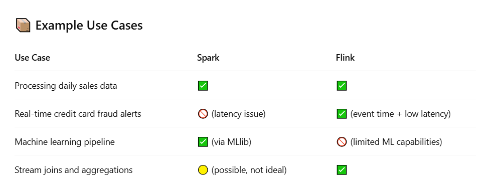

## 🚀 When to Use Spark vs. Flink

### ✅ Use **Spark** if:
- You are working with **large-scale batch jobs**
- You need a **well-supported machine learning** or **SQL engine**
- You are okay with **near-real-time** processing (latency in seconds)

### ⚡ Use **Flink** if:
- You need **millisecond-level latency**
- You require **event-time semantics** and advanced time handling
- You want to build **stateful stream processing** applications with low latency

