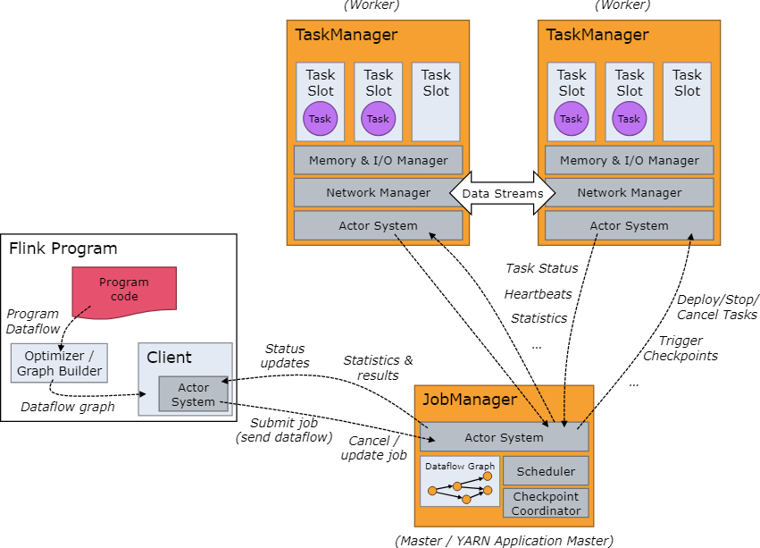

# Anatomy of a Flink Cluster  
The Flink runtime consists of two types of processes
- a JobManager 
- one or more TaskManagers



## JobManager:  
The JobManager has a number of responsibilities related to coordinating the distributed execution of Flink Applications:  
- it decides when to schedule the next task (or set of tasks)  
- reacts to finished tasks or execution failures  
- coordinates checkpoints  
- and coordinates recovery on failures  

This process consists of three different components:  
- ResourceManager  
- Dispatcher  
- JobMaster  

## TaskManagers:  
- The TaskManagers (also called workers) execute the tasks of a dataflow, and buffer and exchange the data streams.  
- The smallest unit of resource scheduling in a TaskManager is a task slot. The number of task slots in a TaskManager indicates the number of concurrent processing tasks.  

🔹 Flink's distributed execution model consists of:  

JobManager – Manages task scheduling and failure recovery.  
TaskManager – Executes tasks and maintains state.  
Checkpointing & State Backend – Ensures fault tolerance.  

📌 Key Concepts:
✅ Stream Processing vs Batch Processing – Flink supports both.
✅ Event Time, Processing Time, and Ingestion Time – Important for accurate event handling.

📌 Key APIs to Learn:    
✅ DataStream API – Handles unbounded data streams.  
✅ DataSet API – Used for batch processing.  
✅ Table API & SQL – Used for declarative queries.     

---

### Checkpointing & State Management (Fault Tolerance): 
📌 Enable Checkpointing:  
env.enableCheckpointing(5000);  // Checkpoint every 5 seconds

📌 State Backends:  
✅ MemoryStateBackend – Fast but limited to small jobs.  
✅ FsStateBackend – Saves state to disk/HDFS.  
✅ RocksDBStateBackend – Recommended for large-scale production workloads.  

📌 Configuring RocksDB State Backend (Recommended for production):  

#### Windowing & Watermarks (Handling Event Time):  
📌 Key Concepts:  
✅ Tumbling Window – Fixed-size, non-overlapping windows.  
✅ Sliding Window – Overlapping windows with a fixed step size.  
✅ Session Window – Dynamic based on activity gaps.  
✅ Watermarks help handle out-of-order events.  
✅ Event Time vs Processing Time  

--
## Handling High Throughput & Performance Tuning:  
📌 Optimize Parallelism:  
```
env.setParallelism(4);
```
📌 Enable Asynchronous Checkpoints:
```
env.getCheckpointConfig().enableUnalignedCheckpoints();
```
📌 Configure RocksDB for Large-Scale Jobs:  
```
env.setStateBackend(new RocksDBStateBackend("hdfs:///flink-checkpoints"));
```

## What is an Operator in Flink?  
In Apache Flink, an operator is a fundamental building block of a data processing pipeline. Operators define how data is transformed,   processed, or aggregated as it flows through the Flink job.  

Types of Operators in Flink:  
- Source Operators (Reading Data):  
- Transformation Operators (Processing Data)  
Common transformations include map, filter, flatMap, keyBy, window, reduce, and join.   
- Sink Operators (Writing Data):  

 Operator Chaining in Flink:  
 Flink automatically chains compatible operators together into a single task to improve performance.  

 ### Tasks and Operator Chains in Flink:  
 In Apache Flink, a task is the unit of execution, and operator chaining is an optimization that combines multiple operators into a single task to improve efficiency.

Consider the following data pipeline:  
Source → Map → Filter → KeyBy → Window Aggregate → Sink   
Task #	Chained Operators  
Task 1	Source  
Task 2	Map → Filter  
Task 3	KeyBy  
Task 4	Window Aggregate  
Task 5	Sink  
Here, Map and Filter are chained together into a single task, reducing unnecessary overhead.  


