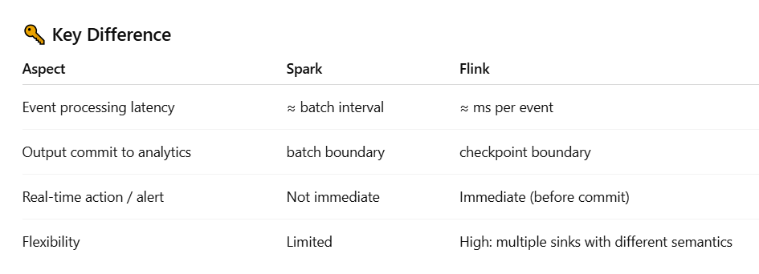

# Anatomy of a Flink Cluster  
The Flink runtime consists of two types of processes
- a JobManager 
- one or more TaskManagers


## JobManager:  
The JobManager has a number of responsibilities related to coordinating the distributed execution of Flink Applications:  
- it decides when to schedule the next task (or set of tasks)  
- reacts to finished tasks or execution failures  
- coordinates checkpoints  
- and coordinates recovery on failures  

This process consists of three different components:  
- ResourceManager  
- Dispatcher  
- JobMaster  

## TaskManagers:  
- The TaskManagers (also called workers) execute the tasks of a dataflow, and buffer and exchange the data streams.  
- The smallest unit of resource scheduling in a TaskManager is a task slot. The number of task slots in a TaskManager indicates the number of concurrent processing tasks.  

🔹 Flink's distributed execution model consists of:  

JobManager – Manages task scheduling and failure recovery.  
TaskManager – Executes tasks and maintains state.  
Checkpointing & State Backend – Ensures fault tolerance.  

📌 Key Concepts:
✅ Stream Processing vs Batch Processing – Flink supports both.
✅ Event Time, Processing Time, and Ingestion Time – Important for accurate event handling.

📌 Key APIs to Learn:    
✅ DataStream API – Handles unbounded data streams.  
✅ DataSet API – Used for batch processing.  
✅ Table API & SQL – Used for declarative queries.     

---

### Checkpointing & State Management (Fault Tolerance): 
📌 Enable Checkpointing:  
env.enableCheckpointing(5000);  // Checkpoint every 5 seconds

📌 State Backends:  
✅ MemoryStateBackend – Fast but limited to small jobs.  
✅ FsStateBackend – Saves state to disk/HDFS.  
✅ RocksDBStateBackend – Recommended for large-scale production workloads.  

📌 Configuring RocksDB State Backend (Recommended for production):  

#### Windowing & Watermarks (Handling Event Time):  
📌 Key Concepts:  
✅ Tumbling Window – Fixed-size, non-overlapping windows.  
✅ Sliding Window – Overlapping windows with a fixed step size.  
✅ Session Window – Dynamic based on activity gaps.  
✅ Watermarks help handle out-of-order events.  
✅ Event Time vs Processing Time  

--
## Handling High Throughput & Performance Tuning:  
📌 Optimize Parallelism:  
```
env.setParallelism(4);
```
📌 Enable Asynchronous Checkpoints:
```
env.getCheckpointConfig().enableUnalignedCheckpoints();
```
📌 Configure RocksDB for Large-Scale Jobs:  
```
env.setStateBackend(new RocksDBStateBackend("hdfs:///flink-checkpoints"));
```

## What is an Operator in Flink?  
In Apache Flink, an operator is a fundamental building block of a data processing pipeline. Operators define how data is transformed,   processed, or aggregated as it flows through the Flink job.  

Types of Operators in Flink:  
- Source Operators (Reading Data):  
- Transformation Operators (Processing Data)  
Common transformations include map, filter, flatMap, keyBy, window, reduce, and join.   
- Sink Operators (Writing Data):  

 Operator Chaining in Flink:  
 Flink automatically chains compatible operators together into a single task to improve performance.  

 ### Tasks and Operator Chains in Flink:  
 In Apache Flink, a task is the unit of execution, and operator chaining is an optimization that combines multiple operators into a single task to improve efficiency.

Consider the following data pipeline:  
Source → Map → Filter → KeyBy → Window Aggregate → Sink   
Task #	Chained Operators  
Task 1	Source  
Task 2	Map → Filter  
Task 3	KeyBy  
Task 4	Window Aggregate  
Task 5	Sink  
Here, Map and Filter are chained together into a single task, reducing unnecessary overhead. 

### Why does Flink have separate concepts of Distributed State and Checkpointing?  
What is Distributed State?  

Distributed State is the live, in-memory state that Flink operators maintain while processing streaming data.  

In a Flink job, the state is attached to operators and distributed across TaskManagers.  

Types of Distributed State:  
Type	                  Description
Keyed State	              Maintained per key; distributed across partitions
Operator State	          Local to operator instance (example: Kafka consumer offsets)

Why Distributed State Exists:  
- Enables stateful stream processing (aggregations, pattern matching, ML features, etc.)  
- Scales horizontally as state is split across cluster nodes. 
- Provides high throughput & low latency since it lives in fast local memory or RocksDB  

What is Checkpointing?  
Checkpointing creates periodic, consistent snapshots of distributed state and stores them in durable storage (e.g., S3, HDFS).  

Why Checkpointing Exists?  
- Provides fault tolerance for streaming applications
- Allows job recovery without data or state loss
- Enables exactly-once processing guarantees  


### Flink vs spark checkpointing:  




### Spark vs flink timeline:  
Time → 

Spark Structured Streaming (Batch Interval = 5 sec)
|--------- Batch 1 ---------|--------- Batch 2 ---------|
Events arrive → Buffered → Process batch → Commit outputs
Processing latency ≈ 5 sec
Output visible after batch
Real-time actions → delayed by batch (cannot trigger instantly)

Flink Streaming (Checkpoint Interval = 5 sec)
Event1 Event2 Event3 Event4 ...
  |     |     |     |
Process instantly → trigger real-time actions (alerts, API calls)
Sink write buffered → committed at checkpoint boundary
Processing latency = ms
Output visibility latency ≈ checkpoint interval (5 sec)   

### Apache Flink Real-Time Processing & Exactly-Once Semantics  
1. Checkpointing and State Management  
- Flink maintains distributed state and periodically takes checkpoints for recovery.  
- Checkpoints store source offsets, operator state, timers, and watermark positions.  
- On failure, Flink restores state from the latest checkpoint, ensuring no data loss.  

--- 

2. Exactly-Once Semantics  
- Exactly-once guarantees that state updates and transactional sinks are committed once, even after failures.  
- Checkpoint interval determines when transactional sinks are committed, e.g., every 5 seconds.  
- Processing is continuous, but output visibility for sinks happens at checkpoint boundaries.  
- External side effects (e.g., alerts, API calls) are not automatically exactly-once; they require idempotency to avoid duplicates.  

---   

3. At-Least-Once Semantics  
- Records are written immediately to sinks, but duplicates may occur on failure/replay.  
- Checkpoints are still used for state recovery.  
- Latency is lower than exactly-once, but consumers must handle duplicates via idempotent writes or deduplication.  


  