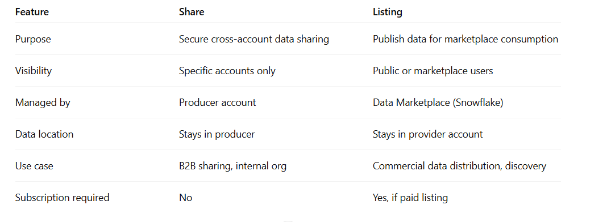

-- =====================================================
-- Snowflake Data Sharing -Script
-- Share Name: CON_SHARE
-- This script sets up:
-- 1. Producer database and schema 
-- 2. Sample tables
-- 3. Share creation
-- 4. Grants for existing tables
-- 5. Automation for sharing future tables
-- =====================================================

-- ========================
-- STEP 0: Use ACCOUNTADMIN role
-- ========================
USE ROLE ACCOUNTADMIN;

-- ========================
-- STEP 1: Create Producer Database and Schema
-- ========================
CREATE OR REPLACE DATABASE POC_DB;
CREATE OR REPLACE SCHEMA POC_DB.SHARE_POC;

-- ========================
-- STEP 2: Create Sample Tables in Producer Schema
-- ========================
CREATE OR REPLACE TABLE POC_DB.SHARE_POC.EMPLOYEES (
    ID INT,
    NAME STRING,
    DEPARTMENT STRING,
    SALARY NUMBER,
    SSN STRING
);

INSERT INTO POC_DB.SHARE_POC.EMPLOYEES VALUES
(1,'Alice','HR',1000,'123-45-6789'),
(2,'Bob','IT',2000,'987-65-4321');

CREATE OR REPLACE TABLE POC_DB.SHARE_POC.DEPARTMENTS (
    DEPT_ID INT,
    DEPT_NAME STRING
);

INSERT INTO POC_DB.SHARE_POC.DEPARTMENTS VALUES
(1,'HR'),
(2,'IT');

-- ========================
-- STEP 3: Create a Share for Consumer Accounts
-- ========================
CREATE OR REPLACE SHARE CON_SHARE;

-- ========================
-- STEP 4: Grant Database and Schema Usage to Share
-- ========================
GRANT USAGE ON DATABASE POC_DB TO SHARE CON_SHARE;
GRANT USAGE ON SCHEMA POC_DB.SHARE_POC TO SHARE CON_SHARE;

-- ========================
-- STEP 5: Grant Existing Tables to Share
-- ========================
GRANT SELECT ON ALL TABLES IN SCHEMA POC_DB.SHARE_POC TO SHARE CON_SHARE;

-- ========================
-- STEP 6: Add Consumer Account to the Share
-- Replace <CONSUMER_ACCOUNT_LOCATOR> with your consumer account locator
-- ========================
ALTER SHARE CON_SHARE ADD ACCOUNT = <ACCOUNTLOCATOR>;

-- ========================
-- STEP 7: Simulate Automatic Future Table Sharing
-- Since Snowflake does not allow future grants directly to a share,
-- we use a TASK to periodically grant SELECT on any new tables to the share
-- ========================

-- Create a Task Warehouse (if not exists)
CREATE OR REPLACE WAREHOUSE SHARE_TASK_WH
    WAREHOUSE_SIZE = SMALL
    AUTO_SUSPEND = 60
    AUTO_RESUME = TRUE;

-- Create Task to automatically grant new tables to the share
CREATE OR REPLACE PROCEDURE SP_AUTO_GRANT_NEW_TABLES()
RETURNS STRING
LANGUAGE JAVASCRIPT
AS
$$
    var sql_command = "";
    var stmt_tables = snowflake.createStatement({
        sqlText: `SELECT TABLE_NAME
                  FROM INFORMATION_SCHEMA.TABLES
                  WHERE TABLE_SCHEMA = 'SHARE_POC'
                    AND TABLE_CATALOG = 'POC_DB'
                    AND TABLE_TYPE = 'BASE TABLE'
                    AND TABLE_NAME NOT IN (
                        SELECT OBJECT_NAME
                        FROM SNOWFLAKE.ACCOUNT_USAGE.OBJECT_GRANTS
                        WHERE GRANTEE = 'CON_SHARE'
                    )`
    });
    var rs = stmt_tables.execute();
    while (rs.next()) {
        var table_name = rs.getColumnValue(1);
        sql_command = `GRANT SELECT ON TABLE POC_DB.SHARE_POC.` + table_name + ` TO SHARE CON_SHARE`;
        snowflake.createStatement({sqlText: sql_command}).execute();
    }
    return "Done granting new tables to CON_SHARE";
$$;


CREATE OR REPLACE TASK AUTO_SHARE_NEW_TABLES
  WAREHOUSE = SHARE_TASK_WH
  SCHEDULE = 'USING CRON 0 * * * * UTC'
AS
CALL SP_AUTO_GRANT_NEW_TABLES();


-- Start the task
ALTER TASK AUTO_SHARE_NEW_TABLES RESUME;

-- ========================
-- STEP 8: How Consumer Uses the Share
-- ========================
-- In the Consumer Account:
-- CREATE DATABASE CONSUMER_POC_DB FROM SHARE <PRODUCER_ACCOUNT>.CON_SHARE;
-- Users can query shared tables:
-- SELECT * FROM CONSUMER_POC_DB.SHARE_POC.EMPLOYEES;

-- ========================
-- END OF SCRIPT
-- ========================

-- Create a new test table
CREATE OR REPLACE TABLE POC_DB.SHARE_POC.TEST_EMPLOYEES (
    ID INT,
    NAME STRING,
    DEPARTMENT STRING,
    SALARY NUMBER
);

-- Insert initial data
INSERT INTO POC_DB.SHARE_POC.TEST_EMPLOYEES VALUES
(1, 'John', 'Finance', 1500),
(2, 'Jane', 'Marketing', 1800);


SHOW TASKS LIKE 'AUTO_SHARE_NEW_TABLES';

ALTER TASK AUTO_SHARE_NEW_TABLES
SET SCHEDULE = 'USING CRON * * * * * UTC';


SELECT *
FROM TABLE(INFORMATION_SCHEMA.TASK_HISTORY(
    TASK_NAME => 'AUTO_SHARE_NEW_TABLES',
    RESULT_LIMIT => 10
))
ORDER BY SCHEDULED_TIME DESC;




# VIA Listing:  
Publish the Share as a Listing  
```
CREATE OR REPLACE LISTING PARTNER_LISTING
  SHARE = PARTNER_SHARE
  DISPLAY_NAME = 'Company Partner Data'
  DESCRIPTION = 'Curated dataset for partners p1, p2, p3, p4'
  TAGS = ('partners', 'finance', 'HR');
  ```
### Notes:  
1. You can configure the listing as public or private. For your partners, use private listing.  
2. You can manage subscriptions per partner.  

#### Add Partner Accounts / Subscribers:  
In a private listing, you must authorize partner accounts to subscribe:  
```
ALTER LISTING PARTNER_LISTING ADD ACCOUNT = '<PARTNER1_ACCOUNT_LOCATOR>';
ALTER LISTING PARTNER_LISTING ADD ACCOUNT = '<PARTNER2_ACCOUNT_LOCATOR>';
-- Repeat for P3, P4
```

#### Partner Subscription:  
1. Each partner logs into their Snowflake account, discovers your listing, and subscribes.
2. Once subscribed, the partner can create a database from your listing:  
```
CREATE DATABASE PARTNER1_DB FROM SHARE <PRODUCER_ACCOUNT>.PARTNER_SHARE;
```

### Monitor subscriptions and consumption via:   
SHOW LISTINGS;  
SHOW SHARES;  

#### Track query usage by partners:
```
SELECT * FROM SNOWFLAKE.ACCOUNT_USAGE.QUERY_HISTORY
WHERE USER_NAME IN ('PARTNER1_USER', 'PARTNER2_USER');

```


